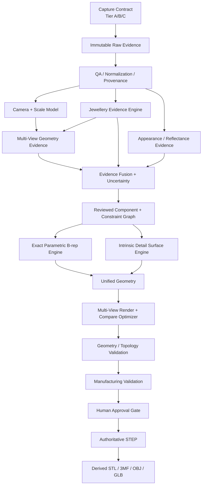

# Final Architecture V1.0

## Architecture thesis

**Lalitha is not a 2D-to-3D generator.** It is an evidence-driven jewellery reverse-engineering and CAD system.

The architecture intentionally keeps three things separate until validation:
1. what the camera actually observed;
2. what algorithms infer about geometry/appearance;
3. what the CAD/manufacturing system decides or designs.

## System data flow



## Capture contract

### Tier A — exploratory
- 1–5 uncontrolled images.
- Allowed claims: segmentation, visual proposals, coarse/non-metric reconstruction.
- Forbidden claim: manufacturing-accurate geometry.

### Tier B — product reconstruction
- Target: 8–12 guided views for production validation, while retaining support for the existing 5-view research contract.
- At least one known dimension: inner diameter, calibrated stone dimension or reference target.
- Consistent capture/background/focus where possible.
- Allowed claims: structural and metric candidate after validation.

### Tier C — intrinsic-detail laboratory
- controlled multi-view;
- known lighting or illumination sequence;
- cross-polarization/polarimetric capture for reflective detail when justified;
- ground-truth CAD/scan where possible.

## Module 0 — Immutable evidence and QA

**Objective:** never lose the original evidence or silently alter coordinate systems.

**Input:** RGB images, EXIF if present, capture metadata, known dimensions.  
**Output:** hashes, source images, normalized derivatives, crop transforms, focus/blur/exposure warnings, view labels, provenance.

**Current methods:** OpenCV and project upload auditor.  
**Training:** none required.  
**Failure modes:** blurred views, clipping, reflections, missing views, unknown coordinate mapping.  
**Validation:** deterministic regression tests and hash-preservation.

## Module 1 — Camera, view and scale model

**Objective:** estimate camera geometry without pretending it is better known than the capture allows.

**Candidates:**
- calibrated camera solution when Tier B/C metadata exists;
- COLMAP baseline;
- VGGT camera/point-map hypothesis;
- independent per-view camera fitting for independently framed product images;
- DUSt3R/MASt3R only as research candidates because their current public licenses are non-commercial.

**Output:** intrinsics/extrinsics, scale state, uncertainty, cross-view transformation graph.

**Hard rule:** no millimetre claim without known metric scale.

## Module 2 — Jewellery Evidence Engine

**Objective:** extract inspectable evidence, not final CAD.

**Current:** OpenCV, SAM 2.1 Tiny, GrabCut, tiny U-Net, Phase 2.3 evidence graph.  
**Benchmark candidates:** Grounding DINO + SAM2, HQ-SAM-family boundary refinement.

**Output:**
- foreground;
- metal/stone/support/negative-space proposals;
- edges;
- internal ridges/valleys/relief responses;
- highlight/reflection proposals;
- generic local instances;
- stable observation IDs;
- confidence/provenance.

**Hard rule:** a bright region is not automatically a stone; a dark region is not automatically a cavity.

## Module 3 — Multi-view Geometry Evidence

Independent branches should disagree explicitly rather than overwrite each other.

Branches:
- visual hull / voxel carving: deterministic silhouette constraint;
- feature/SfM/MVS: COLMAP;
- feed-forward geometry: VGGT;
- relative depth: Depth Anything V2 Small benchmark;
- normals: DSINE benchmark;
- dense matching: MASt3R/DUSt3R research only;
- reflective reconstruction: NeRO/NeRSP/SpecGloss-GS experiments after ground truth exists.

Each branch writes a common evidence record rather than directly modifying the authoritative CAD.

## Module 4 — Appearance / Reflectance Evidence

**Purpose:** separate appearance changes from true shape.

Store:
- possible albedo/material boundary;
- specular highlight probability;
- shadow likelihood;
- gemstone/refraction region;
- roughness/metalness hypothesis when useful;
- lighting/capture condition.

This prevents a highlight from becoming a groove and a reflection from becoming a physical protrusion.

## Module 5 — Evidence Fusion + Uncertainty

Fuse only evidence that refers to compatible coordinates and physical meaning.

Each fused datum records:
- source methods;
- supporting views;
- residual/disagreement;
- confidence calibration;
- state: observed/inferred/designed/unknown.

Conflicting evidence is not averaged blindly. It is routed to review or a targeted experiment.

## Module 6 — Reviewed Component & Constraint Graph

This is the **semantic backbone** of Lalitha V1.

Each component stores:
- `component_id`;
- `track_id`;
- semantic class + confidence;
- visible and amodal masks by view;
- parent/support relationships;
- pose;
- dimensions and uncertainty;
- geometry generator or free-form surface link;
- manufacturing role;
- dependency rules;
- provenance state.

Example:

```text
RING
├── SHANK
└── HEAD
    ├── STONE_001
    │   ├── SEAT_001
    │   ├── PRONG_001
    │   ├── PRONG_002
    │   ├── PRONG_003
    │   └── PRONG_004
    ├── GALLERY
    └── RELIEF_PATCH_001
```

This replaces the weaker idea of a one-shot “jewellery vision engine” that emits final semantics directly.

## Module 7 — Exact Parametric B-rep Engine

**Authoritative for functional jewellery geometry.**

Use CadQuery/OpenCascade for:
- shank;
- shoulders;
- stones as separate solids;
- prongs/claws;
- bezels;
- galleries;
- stone seats;
- cavities/negative geometry;
- repeated/symmetric structures;
- Boolean operations;
- STEP export.

The project has already demonstrated a valid Ring01 exact-solid route. Generalization is still unproven.

## Module 8 — Intrinsic Detail Surface Engine

Use a representation matched to the detail.

### Shallow relief
For base surface point \(P(u,v)\), normal \(n(u,v)\) and displacement field \(h(u,v)\):

\[
P'(u,v)=P(u,v)+h(u,v)n(u,v)
\]

Suitable for engravings, embossed relief and shallow sculpting.

### Complex organic relief
Use local NURBS/subdivision/free-form patches for:
- deity faces;
- deep lips/eyes/noses;
- hair/crown;
- irregular ornamental carving;
- overhangs that are not representable by a single height field.

Every patch attaches to a named B-rep frame and must pass wall/topology checks.

## Module 9 — Unified render-and-compare fitting

Fit CAD/detail parameters by re-rendering the current model from every accepted camera hypothesis.

Use multiple objectives, but validate the **exported exact geometry**, not merely an internal differentiable proxy.

PyTorch3D can support differentiable camera/geometry losses, while exact-solid checks remain in the CAD kernel.

## Module 10 — Validation

### Visual
- silhouette IoU;
- boundary F1;
- detail-region IoU;
- reprojection residual;
- image similarity used carefully for appearance only.

### 3D
- Chamfer distance;
- Hausdorff distance;
- point-to-surface distance;
- normal consistency;
- scan-to-CAD deviation;
- dimensional error.

### Semantic
- stone count/identity;
- prong count/identity;
- seat/cavity pairing;
- component track consistency.

### CAD/topology
- valid B-rep;
- connectedness where expected;
- self-intersection;
- Boolean validity;
- watertight derived mesh;
- independent STEP readability.

### Manufacturing
- wall/prong minima;
- clearances;
- stone/pavilion collisions;
- cavity breakthroughs;
- mass/volume;
- casting/polishing allowances;
- rule-profile provenance.

## Module 11 — Human approval

Human review is a first-class reliability mechanism, not a temporary embarrassment.

The system should direct attention to:
- low-confidence components;
- disputed cross-view identity;
- inferred hidden geometry;
- deity/figurative landmarks;
- rule-profile violations;
- material/weight assumptions.

## Deployment split

### Local/deterministic
- upload/QA;
- OpenCV;
- evidence store;
- constraint graph;
- CadQuery/OpenCascade;
- Trimesh checks;
- reports;
- Studio UI.

### GPU service / research
- SAM2/Grounding DINO;
- VGGT;
- depth/normal models;
- differentiable rendering;
- reflective neural reconstruction;
- generative 3D benchmarks.

This split allows the product to remain usable even when a heavy research model changes.
