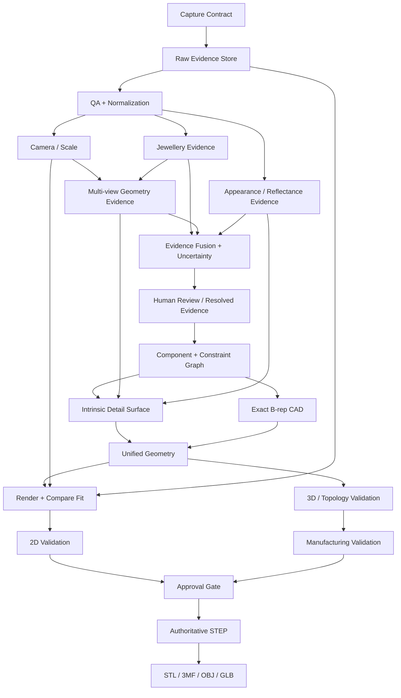

# Module Dependency Graph

## Dependency sanity rules

1. **Scale-dependent modules** cannot run in “metric” mode until `Camera/Scale` supplies a calibrated scale.
2. **Component CAD** cannot be authoritative until semantic evidence is reviewed or exceeds a validated confidence policy.
3. **Intrinsic detail** may consume depth/normals/appearance evidence, but must not write directly to STEP without wall/topology validation.
4. **Manufacturing validation** consumes exact CAD and a versioned rule profile; it does not consume raw RGB as a substitute for a rule.
5. **Generative models** may write to the evidence store only.
6. **Every arrow crossing coordinate systems** carries the transform and uncertainty.
7. **Every derived artifact** records the exact upstream hashes/model versions/configuration.
